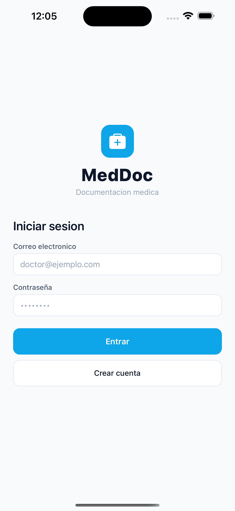
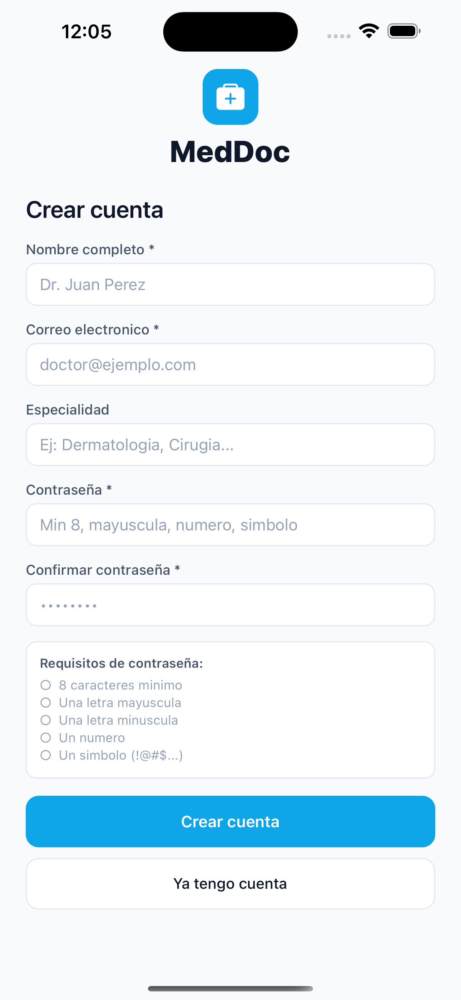
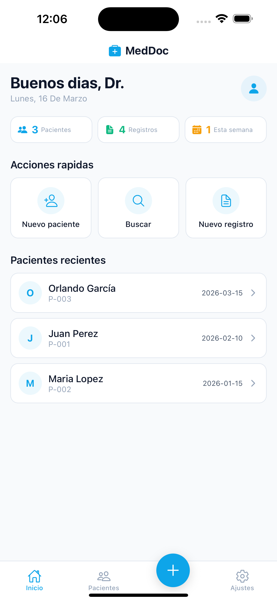
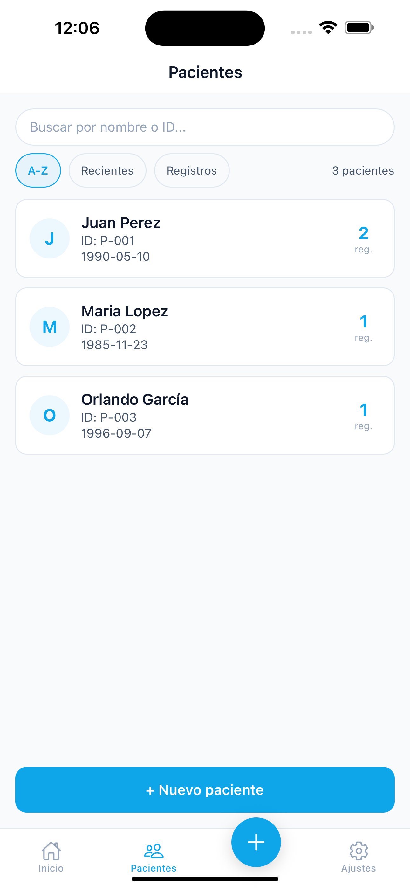
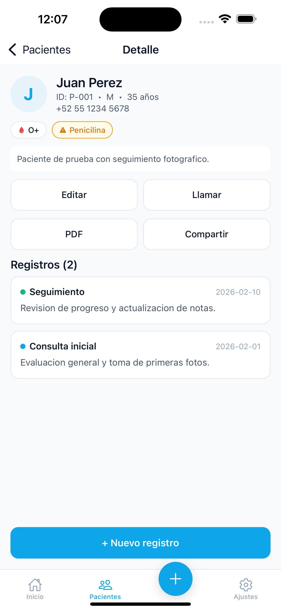
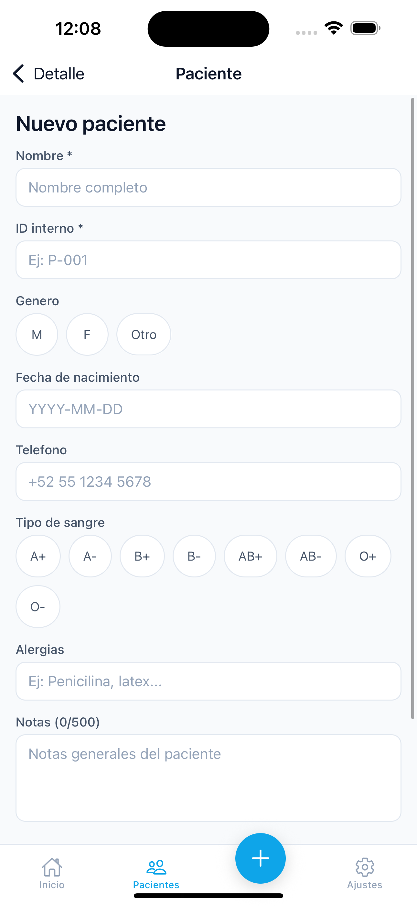
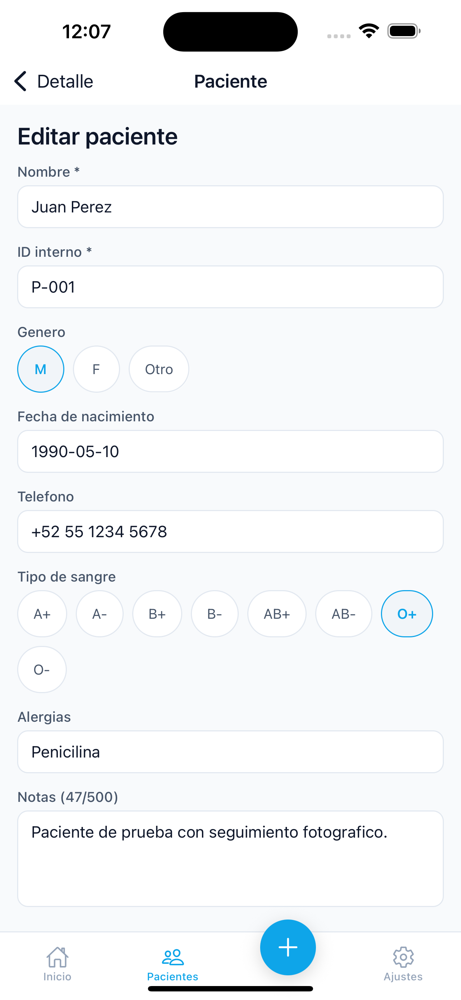
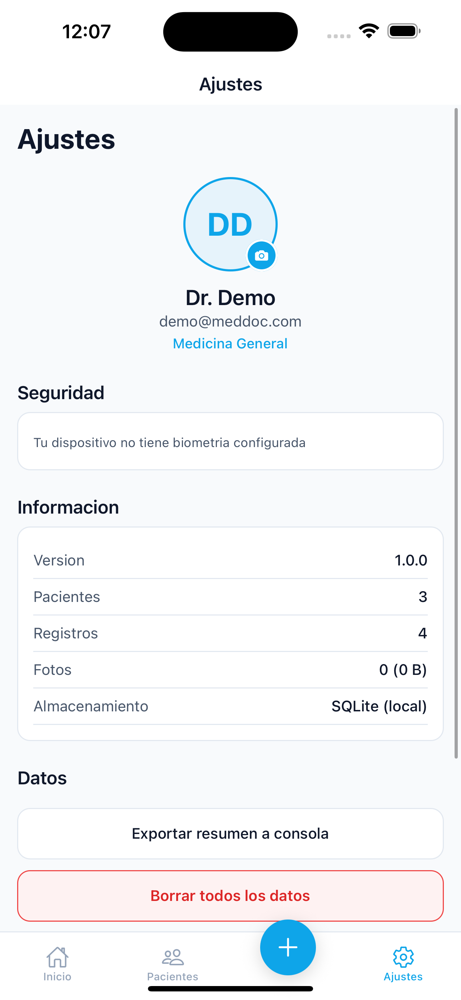

# MedDoc

Medical documentation app for patient record-keeping and photographic follow-up. Built for healthcare professionals who need a fast, offline-first tool to document consultations on their mobile device.

## Screenshots

<p align="center">
  
  
  
  
</p>
<p align="center">
  
  
  
  
</p>

## Features

**Authentication & Security**
- Email/password registration with SHA-256 hashing
- Biometric lock (Face ID / Touch ID)
- Session stored in device Keychain via SecureStore

**Patient Management**
- Full CRUD with search (accent-insensitive) and sorting (A-Z, recent, by records)
- Extended fields: gender, phone, blood type, allergies, notes
- Paginated lists — handles 10,000+ patients
- Long-press to delete with confirmation

**Medical Records**
- Create/edit records per patient with date, category, and description
- 5 category types with color-coded indicators
- Photo documentation: camera or gallery, up to 6 per record
- Image compression (1200px, JPEG 70%) to save storage
- Fullscreen image viewer with swipe navigation

**Dashboard**
- Personalized greeting with doctor's name and profile photo
- Quick stats: patients, records, this week's activity
- Quick actions: new patient, search, new record
- Recent patients list and pending patients (no records yet)

**PDF Reports & Sharing**
- Generate formatted PDF with patient data, medical info, and all records
- Share via email, WhatsApp, AirDrop, or any native share target

**Settings & Profile**
- Doctor profile with photo upload
- Biometric lock toggle
- Storage usage display
- Data export and full reset option

## Tech Stack

| Layer | Technology |
|---|---|
| Framework | React Native 0.81 + Expo SDK 54 |
| Navigation | React Navigation v7 (Bottom Tabs + Native Stack) |
| Database | SQLite (expo-sqlite) with versioned migrations |
| Auth | expo-secure-store + expo-local-authentication |
| Camera | expo-image-picker + expo-image-manipulator |
| PDF | expo-print + expo-sharing |
| Icons | @expo/vector-icons (Ionicons) |
| Validation | validator.js + custom validators |
| Haptics | expo-haptics |
| Tests | Jest + jest-expo |

## Architecture

```
App.js → AuthProvider → DataProvider → RootNavigator
                                        ├── Auth flow (Login / Register)
                                        ├── Lock flow (Biometric)
                                        └── Main tabs
                                            ├── Dashboard
                                            ├── Patients (Stack)
                                            │   ├── List (paginated from SQLite)
                                            │   ├── Detail (paginated records)
                                            │   ├── Edit Patient
                                            │   └── Edit Record
                                            └── Settings
```

**Data flow:**
```
Screens → useData() → DataContext (smart cache + invalidation signals)
                     → database/*.js → SQLite (indexed, paginated)
                     → imageStorage.js → expo-file-system (compressed)
```

## Project Structure

```
src/
├── context/         AuthContext.js, DataContext.js
├── database/        db.js, schema.js, patients.js, records.js, images.js, users.js, seed.js
├── navigation/      RootNavigator.jsx
├── screens/         Dashboard, PatientsList, PatientDetail, EditPatient, EditRecord, Settings
├── screens/auth/    Login, Register, Lock
├── components/      PatientCard, RecordCard, PrimaryButton, Toast, ImageGrid, ImageViewer, etc.
├── theme/           colors.js, styles.js
├── utils/           validation.js, date.js, crypto.js, haptics.js, imageStorage.js, pdfReport.js
├── mock/            patients.js (seed data)
└── __tests__/       validation, date, crypto, imageStorage (32 tests)
```

## Getting Started

```bash
# Clone
git clone https://github.com/Ogarcia000/meddoc-app.git
cd meddoc-app

# Install
npm install

# Run
npm start          # Expo dev server
npm run ios        # iOS simulator
npm run android    # Android emulator

# Test
npm test
```

## Demo Account

Register with these credentials on first launch:

| Field | Value |
|---|---|
| Name | Dr. Demo |
| Email | demo@meddoc.com |
| Password | Test123! |
| Specialty | Medicina General |

## Performance

- **Paginated queries** — Lists load 50 items at a time from SQLite
- **Smart cache** — Invalidation signals prevent unnecessary re-renders
- **Optimized indexes** — 7 SQLite indexes for instant search and sort
- **Image compression** — Photos compressed from ~4MB to ~200KB each
- **LEFT JOIN** instead of correlated subqueries for patient record counts

## License

MIT
